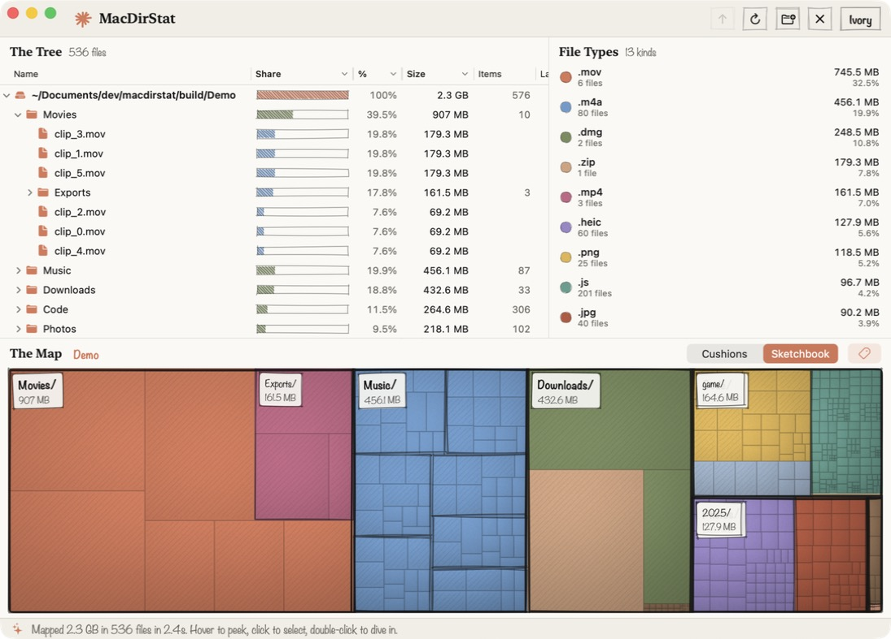
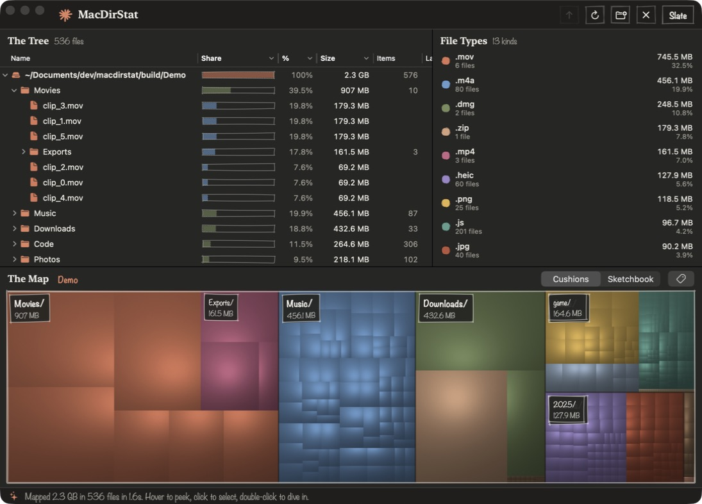

# MacDirStat ✺

**A warm, hand-drawn disk usage map for macOS.** It's inspired by WinDirStat and has the same three views: a
directory tree, a list of file types, and a treemap where big boxes are big files. It's drawn with ivory paper,
clay-orange ink and pencil hatching.



<p align="center">
  
  
</p>

## Features

- **Fast scanning.** It uses `getattrlistbulk(2)` across a pool of worker threads and maps about 3 million files
  in roughly 30 seconds on an Apple silicon Mac. Sizes are bytes actually allocated on disk and match `du`.
  Each hard-linked file is counted once.
- **The Tree.** A native outline view with share bars and sortable name, size, item-count and last-change
  columns. It stays fast even with folders that hold 100k entries.
- **The Map.** A squarified treemap in two styles:
  - *Sketchbook*: flat colors, pencil hatching and wobbly pen outlines around folders.
  - *Cushions*: the classic van Wijk cushion shading from WinDirStat.
  - Big folders get hand-lettered name tags. Click to select, double-click to dive in, and use the breadcrumbs
    to climb back out.
- **File Types.** See which extensions eat your disk, and click one to outline every matching file on the map.
- **Cleanup that's hard to get wrong.** Moving something to the Trash asks first. Right before it acts, it checks
  that the path still points at the item you scanned, so a symlink swap or a replaced file won't redirect it.
- **Four themes:** Ivory, Oat, Clay and Slate (dark).

## Install

### Download

Grab the latest **MacDirStat-x.y.z.dmg** from [Releases](https://github.com/a-barwick/macdirstat/releases/latest),
open it, and drag MacDirStat into Applications. It runs on macOS 14 or later, on Apple silicon and Intel.

**First launch:** MacDirStat isn't signed by an Apple-registered developer, so macOS blocks it the first time
with a message that Apple couldn't verify it. To allow it (you only need to do this once):

1. Click **Done** on the warning.
2. Open **System Settings › Privacy & Security** and scroll down to the Security section.
3. Click **Open Anyway** next to MacDirStat, then confirm.

Or, from Terminal:

```bash
xattr -dr com.apple.quarantine /Applications/MacDirStat.app
```

On macOS 14 you can also right-click the app and choose **Open**.

### Build from source

You need macOS 14 or later and Swift 5.10 or later. Xcode works, and so do the Command Line Tools on their own.

```bash
git clone https://github.com/a-barwick/macdirstat.git
cd macdirstat
./Scripts/build-app.sh
open build/MacDirStat.app
```

An app you build yourself never gets the first-launch warning.

### Seeing everything

macOS protects some folders (Mail, Messages, other users' homes, and so on). To map a whole disk, grant
MacDirStat **Full Disk Access** in System Settings › Privacy & Security. Without it, the footer shows how many
folders it couldn't read.

## Usage

Pick your home folder, Macintosh HD, or any folder. You can also drop a folder onto the window, or start from a
terminal:

```bash
open /Applications/MacDirStat.app --args --scan ~/Downloads
```

| Action | Shortcut |
|---|---|
| Map a folder | ⌘O |
| Rescan | ⌘R (right-click › Rescan This Folder for just one folder) |
| Zoom into selection / out / to top | ⌘↓ / ⌘↑ / ⇧⌘↑ |
| Reveal in Finder / Copy path | ⌥⌘F / ⇧⌘C |
| Move to Trash | ⌘⌫ (asks first) |
| Toggle map labels | ⌘L |
| Switch theme | ⌘1 – ⌘4 |

Moving something to the Trash doesn't free space until you empty the Trash.

## How it works

```
Sources/MacDirStat/
  Model/      FileNode tree, DiskScanner (getattrlistbulk + worker pool), ExtensionRegistry,
              TreeSafety (identity checks, hard-link bookkeeping, tree edits)
  Treemap/    TreemapLayout (squarify + cushion coefficients), TreemapRenderer (pixels + sketch pass),
              TreemapView (NSView: hit-testing, overlays)
  Views/      SwiftUI shell, DirectoryOutline (NSOutlineView), welcome and scanning screens
  Support/    Themes, Sketch (rough.js-style wobbly paths), formatting and whimsy
Tests/        Swift Testing suite, run against real files in a temporary folder
Scripts/      build-app.sh, test.sh, make-icon.swift
```

- **The layout only goes as deep as there are pixels.** It runs on the main thread and stops at tiles too small
  to see, so it stays cheap even with millions of files. The pixel shading runs on background threads and can
  be cancelled. The new picture and its click targets appear together, so what you click is what you see.
- **The tree is only changed on the main thread, through `TreeEdit`.** This keeps totals, sort order and
  hard-link ownership consistent after trashing or rescanning.
- **Nothing touches the disk without `FileIdentity.verify`.** The scan starts from a symlink-free path and
  records each item's inode. Before trashing or rescanning, the path must still resolve to the same object.

## Development

```bash
./Scripts/test.sh        # run the tests (works with just the Command Line Tools)
./Scripts/build-app.sh   # release build → build/MacDirStat.app
```

Contributions are welcome. See [CONTRIBUTING.md](CONTRIBUTING.md).

## Acknowledgements

- [WinDirStat](https://windirstat.net/) and KDirStat, for the idea and the tree + types + treemap layout.
  MacDirStat is an independent project and shares no code with them.
- Jarke J. van Wijk and Huub van de Wetering, *Cushion Treemaps* (1999).
- Mark Bruls, Kees Huizing and Jarke J. van Wijk, *Squarified Treemaps* (2000).
- [Rough.js](https://roughjs.com/), which inspired the hand-drawn strokes.

## License

[MIT](LICENSE)
